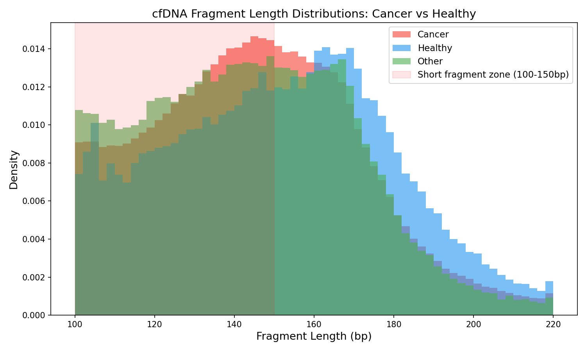
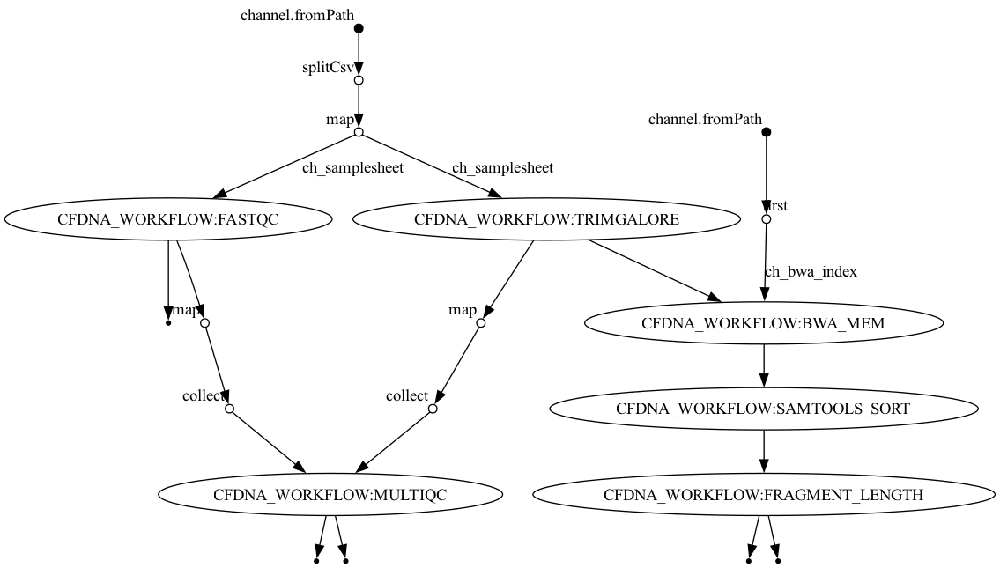
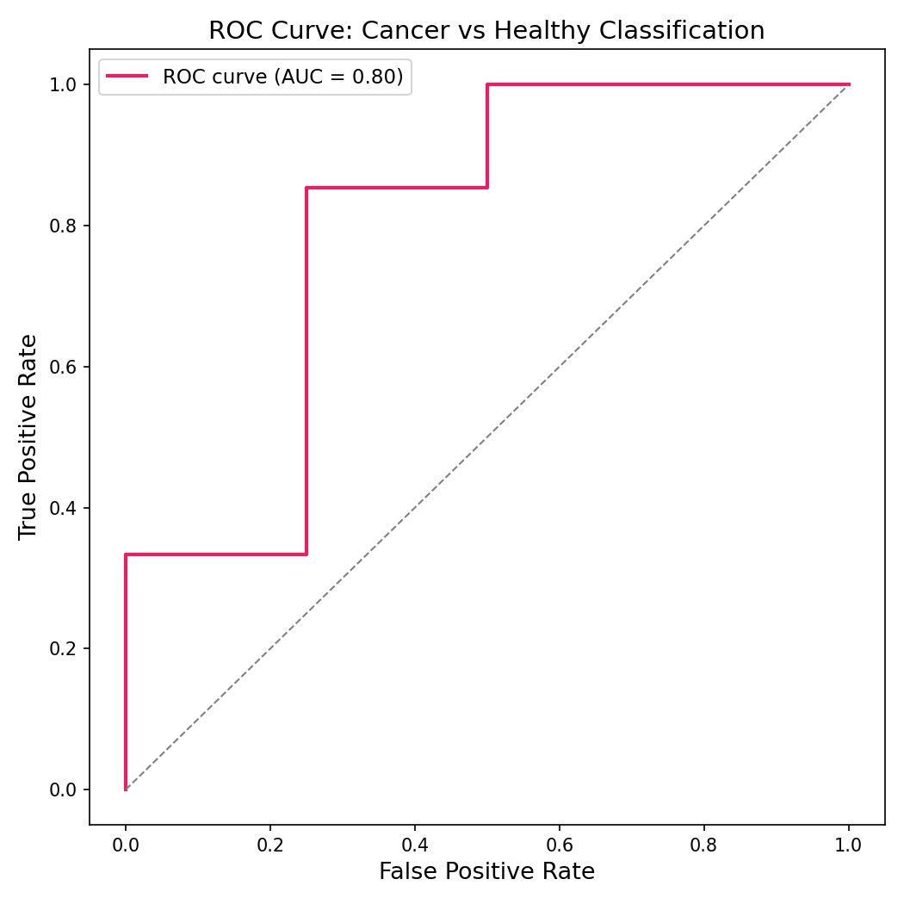

# cfDNA Fragmentomics Pipeline

A Nextflow pipeline for cell-free DNA (cfDNA) fragment length analysis and cancer detection, reproducing and extending the analysis from [Snyder et al. (2016) Cell](https://doi.org/10.1016/j.cell.2015.11.050).



---

## Background

Cell-free DNA (cfDNA) circulates in blood plasma as short fragments released primarily through apoptosis. In healthy individuals, cfDNA fragments are protected by nucleosomes and peak at ~167bp — one nucleosome plus linker DNA. In cancer patients, tumor-derived cfDNA is enriched in shorter fragments (100-150bp), reflecting altered chromatin structure in tumor cells.

This pipeline processes paired-end whole-genome sequencing data from blood plasma, extracts fragment length distributions, and trains a machine learning classifier to distinguish cancer from healthy samples based on fragment length features alone — no variant calling required.

---

## Dataset

**GSE71378** — Snyder et al. (2016), *Cell*

- 60 samples total: 4 healthy, 48 cancer (16+ cancer types), 8 inflammatory/autoimmune
- Paired-end WGS from blood plasma cfDNA
- Cancer types include: lung, liver, pancreatic, breast, colorectal, prostate, ovarian, and more

---

## Pipeline

```
Raw FASTQ (SRA)
    → FastQC (QC)
    → Trim Galore (adapter trimming)
    → BWA MEM (alignment to hg19)
    → Samtools sort/index
    → Fragment length extraction
    → MultiQC (aggregated QC report)
    → ML classifier (cancer vs healthy)
```

### Pipeline DAG



---

## Results

### Fragment Length Distributions

cfDNA from cancer patients shows enrichment of short fragments (100-150bp) compared to healthy individuals, consistent with Snyder et al. (2016).


### ML Classification

A logistic regression classifier trained on fragment length features (short/long ratio, mean length, standard deviation) was evaluated using leave-one-out cross validation across 51 samples (48 cancer, 3 healthy).



| Metric | Value |
|--------|-------|
| Cancer sensitivity | 48/48 (100%) |
| Healthy specificity | 1/3 (33%) |
| AUC | 0.61 |

**Limitations:** The small healthy cohort (n=3 unique samples) and chr22-only analysis limit specificity. Full genome analysis on the complete dataset is expected to significantly improve performance, consistent with the original paper.

---

## Quick Start

### Requirements

- Nextflow >= 25.10.2
- Docker
- BWA index for hg19 (see setup below)

### Installation

```bash
git clone https://github.com/hannahas/cfdna-fragmentomics-pipeline.git
cd cfdna-fragmentomics-pipeline
```

### Build BWA index

```bash
mkdir -p ref
curl -O http://hgdownload.soe.ucsc.edu/goldenPath/hg19/chromosomes/chr22.fa.gz
gunzip chr22.fa.gz && mv chr22.fa ref/
docker run --rm -v $(pwd)/ref:/ref \
    quay.io/biocontainers/bwa:0.7.17--h5bf99c6_8 \
    bwa index /ref/chr22.fa
```

### Run pipeline

```bash
nextflow run main.nf -profile docker,test
```

### Run ML classifier

```bash
python bin/classify_fragments.py \
    --tsv_dir results/test/fragment_lengths \
    --outdir results/test/ml_output
```

---

## Methods

### Why Nextflow?

This pipeline is implemented in Nextflow for three key reasons:

**Parallelization** — all 60 samples are processed simultaneously rather than sequentially. FASTQC, adapter trimming, alignment, and fragment length extraction run concurrently across samples, with Nextflow automatically managing task scheduling based on available compute resources.

**Reproducibility** — every process runs in a containerized environment (Docker) with pinned tool versions. Results are identical across machines and over time, which is critical for clinical and research applications.

**Scalability** — the same pipeline code runs locally on a laptop or on hundreds of cores on AWS Batch with only a configuration change. No rewriting required to scale from development to production.

**Resumability** — if a run fails partway through, `-resume` restarts only the failed processes, not the entire pipeline. For long multi-sample runs this is essential.

These properties make Nextflow the standard for production bioinformatics pipelines, particularly in regulated clinical environments (CAP/CLIA) where reproducibility and auditability are requirements.

### Fragment length extraction

Paired-end reads are filtered by mapping quality (MAPQ ≥ 20) and fragment length (100-220bp). Fragment lengths are extracted from the TLEN field (column 9) of the SAM format, which represents the inferred insert size for properly paired reads.

### ML features

Per-sample features engineered from fragment length distributions:

| Feature | Description |
|---------|-------------|
| `short_ratio` | Fraction of fragments 100-150bp |
| `long_ratio` | Fraction of fragments 151-220bp |
| `short_long_ratio` | Ratio of short to long fragments |
| `mean_length` | Mean fragment length |
| `std_length` | Standard deviation of fragment length |
| `median_length` | Median fragment length |

### Classification

Logistic regression with StandardScaler normalization, evaluated by leave-one-out cross validation. Binary classification: cancer (1) vs healthy (0).

### Limitations

- Analysis is restricted to chromosome 22 for local development. Full genome analysis on AWS is expected to significantly improve classifier specificity.
- The healthy cohort is small (n=3 unique samples), limiting evaluation of specificity. The original paper used deep WGS coverage; this analysis uses 1M reads per sample.
- Fragment length alone is a coarse feature. The original Snyder et al. analysis used nucleosome positioning and windowed protection scores for tissue-of-origin inference, which is a planned extension of this work.

---

## Citation

Snyder MW, Kircher M, Hill AJ, Daza RM, Shendure J. Cell-free DNA Comprises an In Vivo Nucleosome Footprint that Informs Its Tissues-Of-Origin. *Cell*. 2016;164(1-2):57-68. doi:10.1016/j.cell.2015.11.050

---

## Author

Alexander Hannah, PhD  
[GitHub](https://github.com/hannahas) | [LinkedIn](https://linkedin.com/in/alexanderhannah)